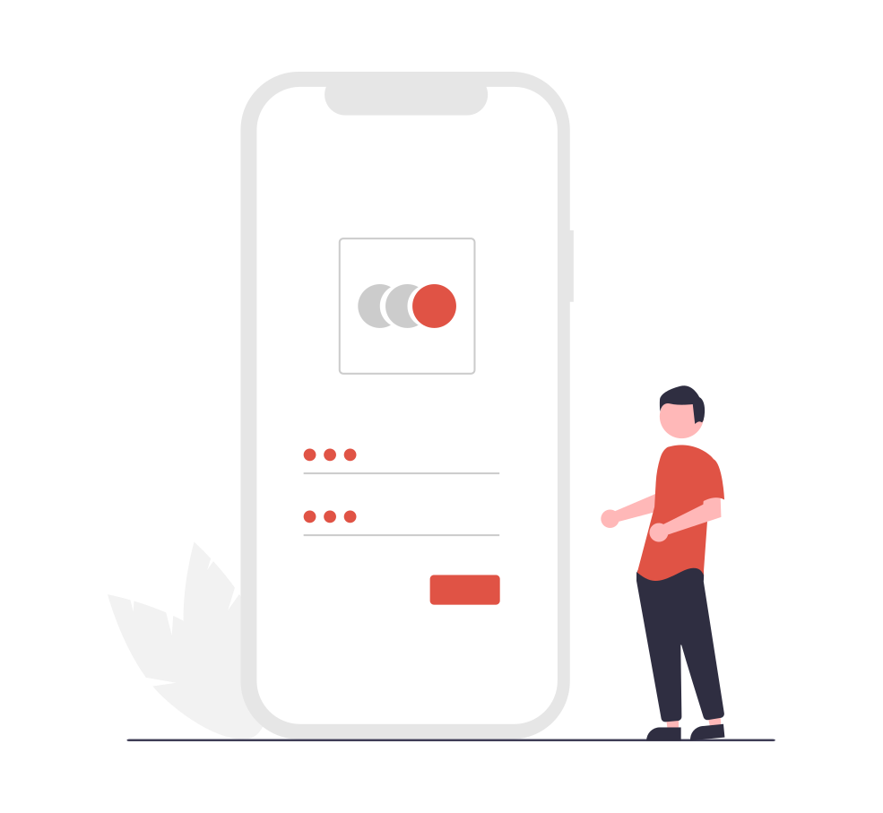

# password-pattern-identification
Cyberres Hackfest 2022 Idea and Demo project

This project is to demonstrate a feature in existing SSPR(Self Service Password Reset) Product that is owned by Micro Focus.

https://hackfest.microfocus.net/26/projects/3971

All rights reserved to Microfocus(now Opentext).

### How to run this application
`FLASK_APP=app.py FLASK_DEBUG=true flask run`

or 

`python3 app.py`

### Pip3 dependencies
* flask
* tinyDB
* enchant